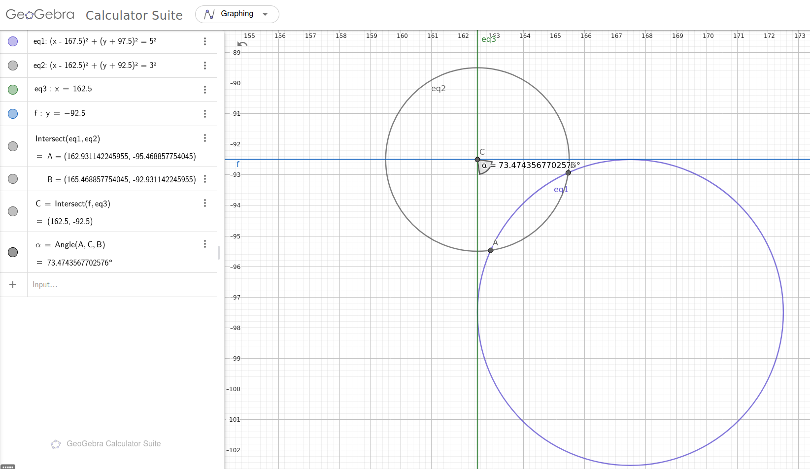

# Hardware

The PCB designs were created in KiCAD and the panels were made using KiKit.

The sensor board is designed to be as small as possible, for this reason some features of the BNO085 are no longer accessible.

## PCB Board Key

Some of the boards are keyed to give them a known orientation. 

Both keys was created from the insersection between the main PCB edge circle and another circle placed in the top right corner of the main circle's bounding box. They are outlined below in the relevant screenshots (the y-axis has been inverted in Geogebra to visually match the KiCAD coordinate system).

### v6

All v6 boards have the same key and same key location. This is a through-hole with a diameter of 1mm. The centre of the key hole is located in the top left corner of the board; -3.35mm from the centre of the board along the x-axis, -3.25mm from the centre of the board along the y-axis. For both board sizes the hole is located in the same place. (Remember the KiCAD y-axis is inverted, therefore the delta-y of -3.25 means the hole is above the centre of the board.) 

### v5

The v5 board design has no physical key, however orientation pads were added to the front and back silkscreen these are in the top-left, top-right and bottom-right corners and can be used to orientate the board.

### v3

### v3-base

This board is the base for the `v3` panel. The difference is the flat spots by each pin to allow it to be panelised. This means the dimensions are slightly different.

